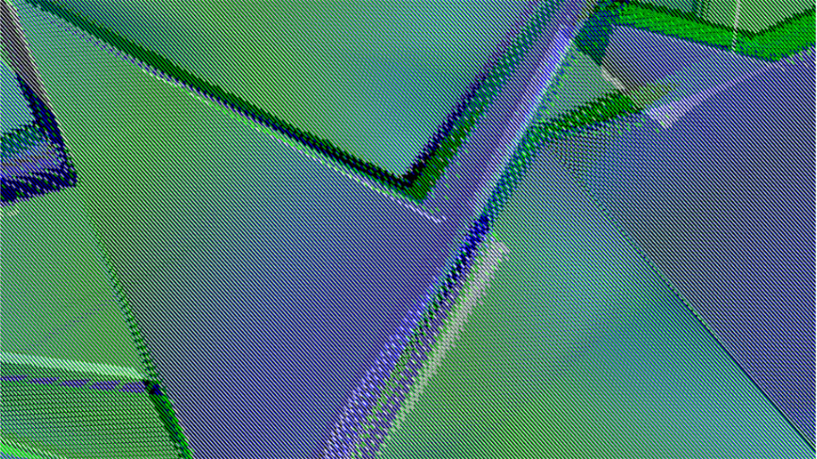

### **Dados Pessoais**

**Nome:** Catarina Sousa

**Número:** 3160581

**Idade:** 19

**Localidade:** Almada

### **Casey Reas**

O norte americano Casey Reas (também conhecido como Casey Edwin Barker Reas ou C. E. B. Reas) nasceu em 1972 em Troy, Ohio. 

Reas é um artista cujos trabalhos exploram ideias através da lente contemporânea de software e professor no departamento de Design de Artes Media na Universidade da Califórnia, Los Angeles. As suas obras de arte baseam-se na criação de imagens a partir do seu software, que derivam de textos curtos que explicam os processos que definem uma rede de ações. As instruções são expressas em diferentes mídias, incluindo linguagem natural, código de máquina e simulações de computador, resultando em imagens dinâmicas e estáticas. Cada tradução revela uma perspectiva diferente no processo e combina com os outros para produzir, continuamente, uma evolução visual.

Em 2001, em conjunto com Ben Fry, criou o “Processing”, uma linguagem de programação direcionada para as artes visuais com uma “IDE”(ambiente de desenvolvimento integrado) sustentado pelo “java” para a criação de imagens, animações e interatividade. 

Em setembro de 2007, Reas e Ben publicaram um livro de introdução à programação dentro do contexto da mídea visual (MIT Press) denominado por *Processing: A Programming Handbook for Visual Designers and Artists*. Além deste também co-escreveu e desenhou o livro *10 PRINT CHR $ (205.5 + RND (1)); : GOTO 10* (MIT Press, 2013) e com Chandler McWilliams e Lust publicou *Form + Code in Design, Art and architecture* (Princeton Architectural Press, 2010), uma introdução não-técnica à história, teória e prática de software nas artes visuais.

Reas começou a escrever um software para produzir as suas próprias imagens complexas, que assumem a forma de impressões, instalações e murais digitais específicos de sites. *"Eu escrevo software para desenhar milhões de linhas em poucos segundos"*, diz ele, *"fazer milhares de cálculos e decisões em uma fração de segundo, ir além do que minha mente pode imaginar sem sua extensão digital"*. Os padrões abstratos e as estruturas que são possíveis de deslocar contidas dentro das suas imagens e animações exploram ideias de transformação e evocam sistemas tanto orgânicos como sintéticos.

Desde 2012, Reas incorporou imagens de difusão no seu trabalho, distorcendo-as algoritmicamente para criar abstrações que retêm os traços da sua função original, representacional.

Reas tem exposto o seu trabalho internacionalmente em instituições como Laboral (Gijon, Espanha), no Museu Cooper-Hewitt (Nova York), no Museu Nacional de Arte, Arquitetura e Design (Oslo), em galerias, incluindo Bitforms (Nova York), BANK (Los Angeles) e [DAM] Berlin e em festivais como Sonar (Barcelona), Ars Electronica (Linz) e Microondas (Hong Kong). 

Alguns dos seus trabalhos:

[2004 - 2010 | Process Compendium ](http://reas.com/compendium_text/)

[2007 | Protean Image](http://www.bitforms.com/reas/protean-image-2)

[2013 | Ultraconcentrated](http://www.bitforms.com/exhibitions/casey-reas-ultraconcentrated/press-release)

[2015 | Linear Perspective ](http://www.cjamesgallery.com/show-detail/linear-perspective)

[2016 | There’s No Distance](http://www.bitforms.com/exhibitions/reas-2016)

### **"There is No Distance"**

Uma das mais recentes exposições de Casey Reas chama-se *"There is No Distance"* , que foi feita na galeria de bitforms em 2016.

O título da exposição refere-se à performatividade de obras baseadas em software. O trabalho aparece como um vídeo tradicional ou animação, mas a composição é em constante mudança e dinâmica; ao invés de serem armazenados em um arquivo exportado, reproduzido e em loop, os visuais produzidos por Reas são gerados por um algoritmo - um conjunto complexo de instruções escritas em código.

Como as obras são instruídas e pré-programadas, elas são teoricamente reproduzíveis. No entanto, a complexidade dos algoritmos - a complexidade disponibilizada pelo software como meio artístico - significa que os arranjos composicionais das obras presentes são sempre inesperados. Isso, sugere uma performatividade inerente ao software. Ou seja, os arranjos composicionais que continuamente geram são sempre únicos. O espectador, portanto, está experimentando um evento irrepetível. O mais recente trabalho "Still Life" de Reas foi colocado  em primeiro plano na exposição. 

*"There Is No Distance"* também alude à síntese e compressão de espaço dentro dessas obras. Cada um é uma "natureza-morta" simulada: uma composição que desconstrói um sólido platônico, composto e apresentado como informação. O espaço dimensional é achatado de modo que múltiplos planos do mesmo sólido ocupem simultaneamente o campo visual. Não há nenhuma referência ao mundo natural, como o assunto deriva da geometria pura. "Still Life" engaja especificamente o interesse do artista no espaço entre a experiência subjetiva de estar no mundo versus a maneira objetiva e analítica como o mundo é medido, dividido e definido.

### **Movimento**

O movimento criado no exercício 4 é um movimento direccionado da esquerda para a direita. A sua velocidade é condicionada pelo rato, sendo esta mais rápida se o rato estiver mais à esquerda e menor se tiver mais à direita. O tamanho do objecto vai diminuindo ou crescendo de acordo com a direção em que estiver a ir. Quando o objecto chega ao máximo ou minimo do comprmimento da janela ele volta novamente para trás.

[Movimento](https://github.com/ESADCR/AP1617/blob/master/catsousa/ex4/movimento/index.html)

